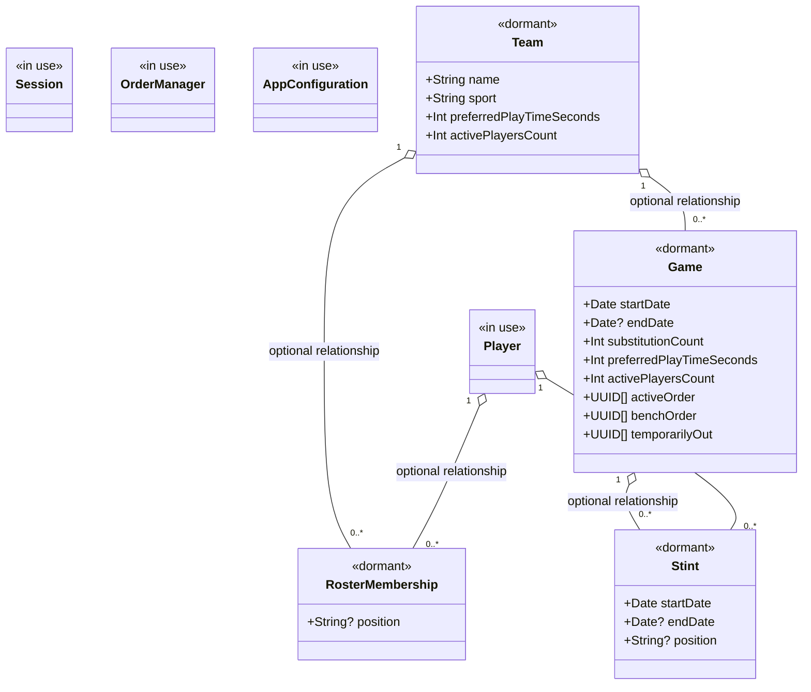

# Data model

The persisted model is mid-transition between two shapes:

- **In use:** `Player`, `Session`, `OrderManager`, `AppConfiguration` — backing
  all current app behavior. Of these, `Player` continues to exist once the
  transition is complete; `Session`, `OrderManager`, and `AppConfiguration`
  are expected to be superseded by the dormant types below.
- **Present but dormant:** `Team`, `RosterMembership`, `Game`, `Stint` —
  declared in the schema; no app code reads or writes them yet.

## Notes

- Every relationship is optional, no type uses `@Attribute(.unique)`, and
  ordered/unordered ID collections (`activeOrder`, `benchOrder`,
  `temporarilyOut`) are plain value attributes rather than `@Relationship`
  arrays. These are CloudKit sync constraints, not stylistic choices — see
  [ADR-0001](../adr/0001-local-only-persistence-no-cloudkit.md).
- The app's shipped `ModelConfiguration` remains local-only
  (`cloudKitDatabase: .none`) per ADR-0001, even though the schema above is
  already shaped to be CloudKit-compatible.
