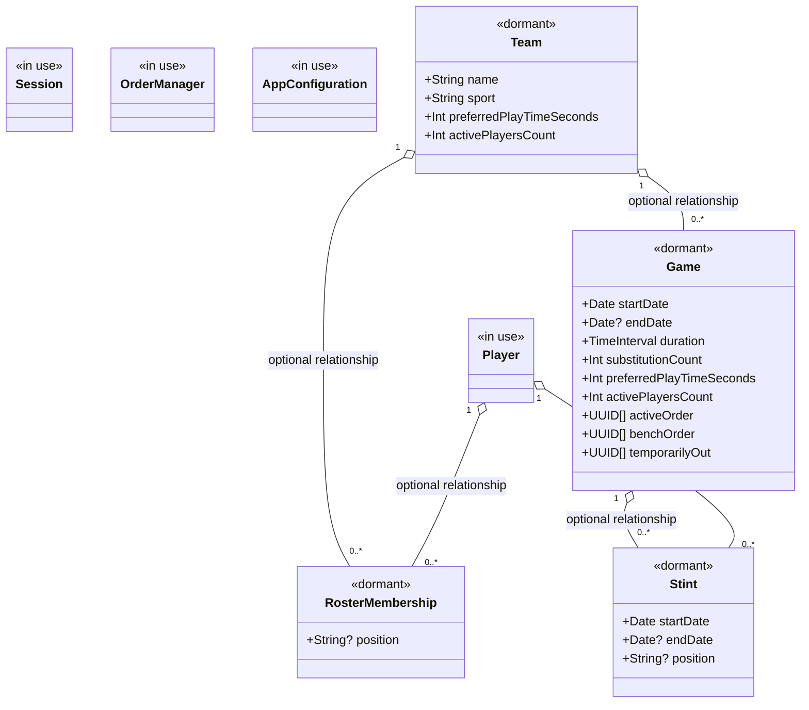
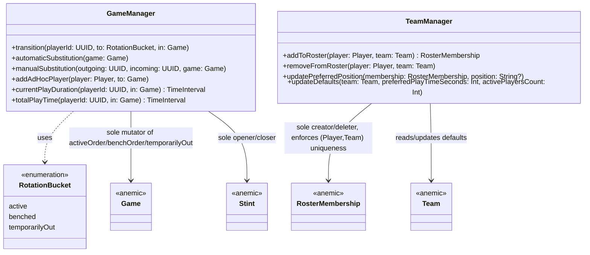
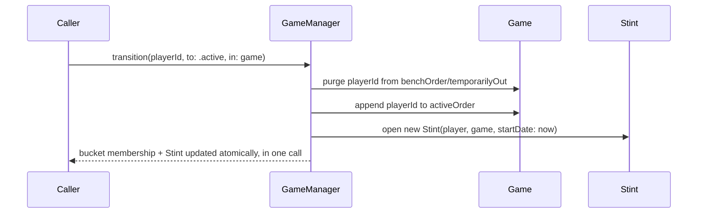
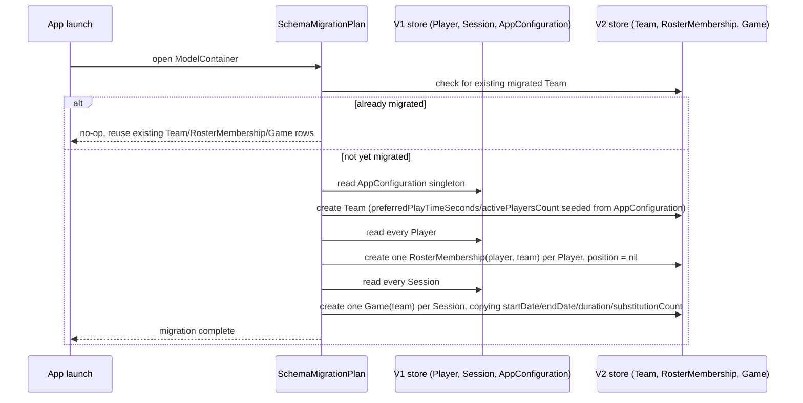
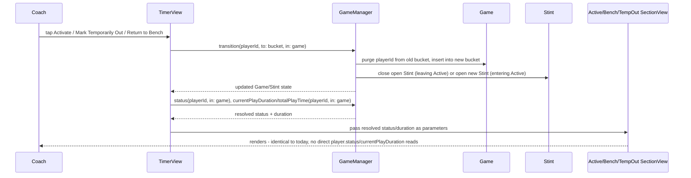

# Data model

The persisted model is mid-transition between two shapes:

- **In use:** `Player`, `Session`, `OrderManager`, `AppConfiguration` — backing
  all current app behavior. Of these, `Player` continues to exist once the
  transition is complete; `Session`, `OrderManager`, and `AppConfiguration`
  are expected to be superseded by the dormant types below.
- **Partially in use:** `Team`, `RosterMembership`, `Game`, `Stint` —
  `TimerView`'s activate/mark-temporarily-out/return-to-bench actions and
  Active/Bench/Temporarily-Out section rendering read/write these via
  `GameManager` (#60); `RosterMembership` and Substitution's own bucket/Stint
  bookkeeping remain unread/unwritten by app UI until later tickets.

## Notes

- Every relationship is optional, no type uses `@Attribute(.unique)`, and
  ordered/unordered ID collections (`activeOrder`, `benchOrder`,
  `temporarilyOut`) are plain value attributes rather than `@Relationship`
  arrays. These are CloudKit sync constraints, not stylistic choices — see
  [ADR-0001](../adr/0001-local-only-persistence-no-cloudkit.md).
- The app's shipped `ModelConfiguration` remains local-only
  (`cloudKitDatabase: .none`) per ADR-0001, even though the schema above is
  already shaped to be CloudKit-compatible.

## GameManager and TeamManager (#58)

`GameManager` and `TeamManager` are the only code allowed to mutate
`Game`/`Stint`/`RosterMembership` — the models themselves stay anemic (no
methods). Both are plain (non-`@Model`) classes, fully unit-tested against
in-memory `ModelContainer`s; the dormant models above are still not read or
written by any app UI, only by these managers' tests.

`transition` stays a single gateway that updates bucket membership and the
open/closed `Stint` together, so the two facts can never drift apart:

## Legacy data migration (#59)

A one-time, idempotent transform, driven by `SubTimerMigrationPlan`
(`SchemaV1` → `SchemaV2`) on `ModelContainer` open, that populates the
dormant `Team`/`RosterMembership`/`Game` rows from the in-use
`Player`/`Session`/`AppConfiguration` data. No `GameManager`/`TeamManager`
involvement — this only produces correct rows for later tickets to wire up.

`SchemaV1` gives `Player` its own frozen, relationship-free snapshot rather
than reusing the real `Player` class: the real class already carries #57's
`rosterMemberships`/`stints` relationships, and reusing it as-is would pull
`RosterMembership`/`Stint`/`Team` into `SchemaV1`'s compiled model too,
making it indistinguishable from `SchemaV2`. `AppConfiguration`/`Session`/
`OrderManager` have no such relationships, so `SchemaV2` reuses them —
and the real `Player`/`Team`/`RosterMembership`/`Game`/`Stint` — directly.

`Game` gained a `duration: TimeInterval` field as part of this ticket: it
has no other way to preserve an in-progress `Session`'s elapsed time (`Session.endDate`
is `nil` while active, so `duration` can't be re-derived from
`startDate`/`endDate` alone), mirroring `Session`'s own two-field shape.

## TimerView rewired onto GameManager (#60)

`TimerView`'s activate, mark-temporarily-out, and return-to-bench actions —
plus Active/Bench/Temporarily-Out section rendering — now go through
`GameManager` against an open `Game`, instead of `Player.status`/
`OrderManager`. Two additions to `GameManager` support this:
`status(playerId:in:) -> RotationBucket` (defaults to `.benched` when a
player is in none of the three buckets, matching `Player.defaultStatus`) and
`setOrder(_:for:in:)` (drag-to-reorder, replacing a bucket's order without
changing membership — `.temporarilyOut` is a no-op, since it's an unordered
`Set`).

`TimerView` resolves-or-creates its `Game` eagerly, on `.onAppear`. A fresh
`Game` is only created when no open one exists for the app's `Team` — for a
real upgrading user, migration (#59) only produces closed, historical
`Game`s, so a fresh `Game` is bootstrapped once from each player's current
`Player.status`/`activatedAtDate`/`OrderManager` order, carrying an
in-progress rotation into the new model without resetting it.

Substitution (still out of scope for a full rewire until #61) keeps its
existing `Player.status`/`OrderManager` writes, but also calls
`GameManager.manualSubstitution` in parallel (for both the automatic and
manual flows - `TimerView` already resolves the specific outgoing/incoming
pair before either reaches this call, so there's no separate need for
`GameManager.automaticSubstitution`'s own pairing logic here), so the
`Game`/`Stint` state this ticket's display path depends on doesn't drift out
of sync with a substitution performed through the old path. `activatePlayer`/
`markPlayerTemporarilyOut`/`returnPlayerToBench` similarly keep a
display-only `Player.status` mirror write (never read back by `TimerView`)
purely so `SettingsView` — unrewired until #62 — doesn't show stale status;
this mirror is tracked as tech debt to remove alongside `Player.status`'s
deletion in #62.

Substitution stays on its existing path for its own display logic here — see
#61 for the follow-on ticket that rewires Substitution and the Live Activity
feed fully onto `GameManager`, at which point `Player.status`/
`currentPlayDuration`/`totalPlayTime`/`OrderManager` will have no remaining
references anywhere in `TimerView`.
